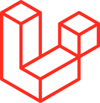
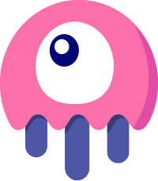

# Wadah Petisi Mahasiswa Unsoed

Soeara adalah platform web yang menyediakan wadah bagi mahasiswa Universitas Jenderal Soedirman (Unsoed) untuk membuat, mendukung, dan menyebarkan petisi secara online. Dengan Soeara, mahasiswa dapat mengajukan petisi tentang berbagai isu dan permasalahan yang mereka hadapi di lingkungan kampus, serta mengumpulkan dukungan dari mahasiswa lain untuk menunjukkan solidaritas dan mendorong perubahan yang diinginkan.

## Fitur Utama

- [ ] Login Email Unsoed
- [ ] Buat petisi, tanda tangan, share
- [ ] Kategori dan pencarian petisi
- [ ] Sertifikat apabila petisi berhasil direspon

## Teknologi yang Digunakan

|  Tailwind CSS |  Alpine.js |  Laravel 11 |  Livewire |
|:---:|:---:|:---:|:---:|

## Pengembangan

Proyek ini merupakan hasil dari mata kuliah Rekayasa Perangkat Lunak, Pemrograman Web II, dan Interaksi Manusia Komputer. Dikembangkan dalam waktu 2 bulan menggunakan metode Rapid Application Development (RAD). Referensi utama untuk fungsionalitas dan desain diambil dari situs web seperti change.org dan tedxits.org.

## Modul

waiting...

## Lisensi

Proyek ini dilisensikan di bawah [MIT License](LICENSE).

## Kontak

Untuk informasi lebih lanjut, silakan hubungi:

- Jehian [[sendomoka](https://github.com/sendomoka/)]
- Brian [[buriane](https://github.com/buriane)]
- Dzakwan [[dzakwanirfan](https://github.com/dzakwanIrfan)]
